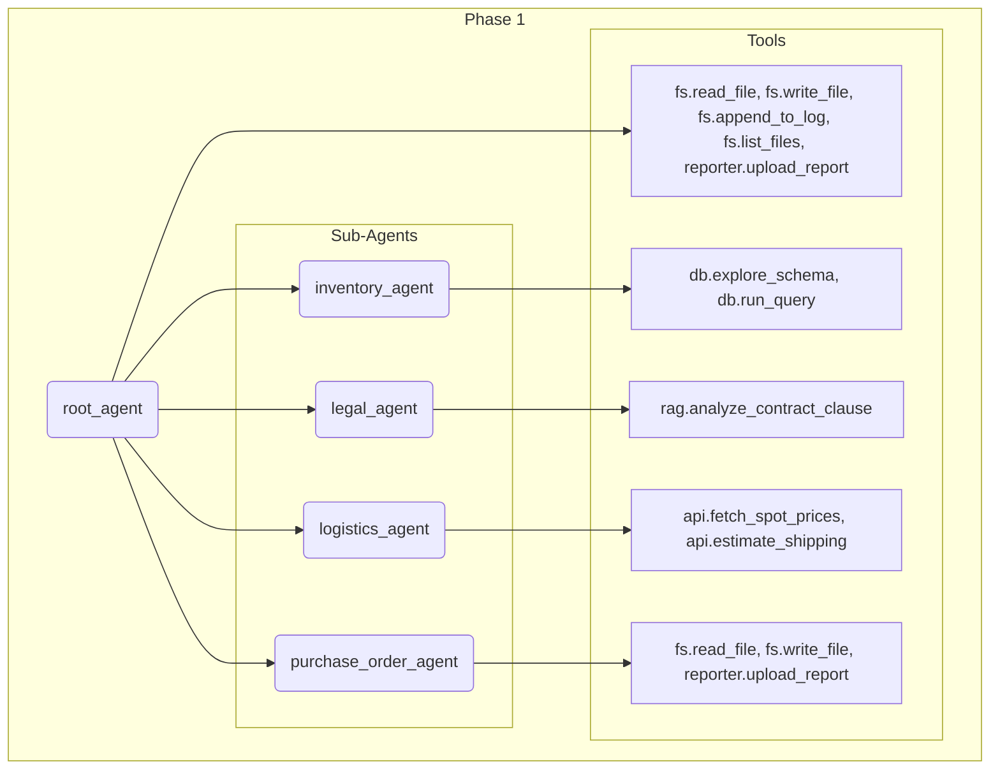
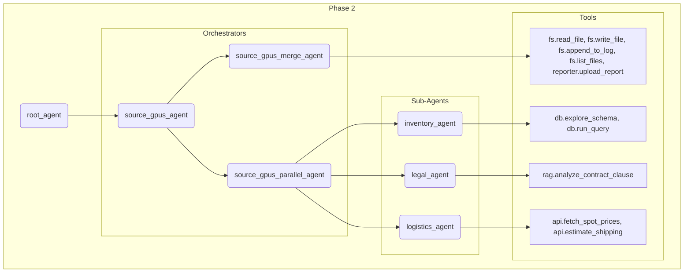

# 🛠️ Environment Setup

## Step 1: Deploy Cloud Resources

Deploy Resources via Makefile:
```bash
make deploy project=YOUR_PROJECT_ID
```

## Step 2a: Run a Live Demo for a given Phase

To run a specific demo phase, use the **make run** target with the phase number input.

```bash
make run phase=YOUR_PHASE_NUMBER
```

For example

```bash
make run phase=1
```

## Step 2b: Run a Headless Test for a given Phase

To run a headless test for a specific demo phase, use the **make test** target with the phase number input.

```bash
make test phase=YOUR_PHASE_NUMBER
```

For example

```bash
make test phase=1
```

## Step 3: Destroy Cloud Resources

Destroy Resources via Makefile:
```bash
make destroy
```

# 🛠️ Environment Phase Overview

## Phase 1



## Phase 2


